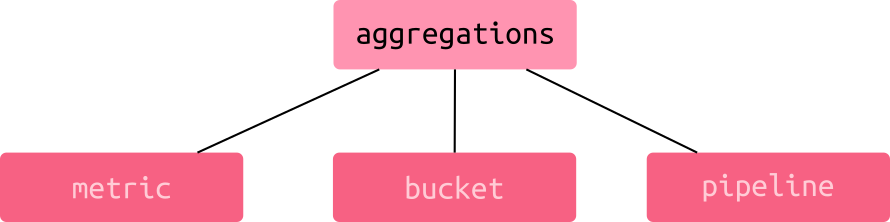

# Agregări

## Introducere

Sunt un mod de a extrage sau grupa date statistice. Ceea ce se poate face folosind agregările, depășește cu mult sfera unor simple statistici. Poți calcula diverse metrici (average, statistici, min/max, procente), poți introduce datele în așa-numite *buckets* utile pentru constituirea unor histograme, afișarea unor intervale, distanțe, termeni cu anumite semnificații care apar în documente. Se pot realiza chiar *pipelines* care permit manipularea mediilor (*moving averages*) sau poți calcula sume cumulative. Mai nou, Elasticsearch permite calcule la nivel matriceal.



Atunci când este necesar, poți să faci imbricare a agregărilor.

Atunci când construiești o agregare, proprietatea care marchează query-ul este `aggs`. Aceasta la rândul ei structurează agregarea printr-un obiect al cărui fiecare proprietate este un nume pe care-l alegi să denumească un bucket, de exemplu, un identificator pe care să-l poți referi mai departe.

De exemplu, să facem o agregare simplă numită `aprecieri`. Agregarea o vom face la nivel de `terms` ca parte a unei căutări. Această căutare se numește [terms aggregation](https://www.elastic.co/guide/en/elasticsearch/reference/current/search-aggregations-bucket-terms-aggregation.html).

```bash
GET /rating/_search
{
  'size': 0,
  'aggs': {
    'aprecieri': {
      'terms': {
        'field': 'rating'
      }
    }
  }
}
```

Opțiunea `size` menționează faptul că nu dorim rezultatele căutării, ci numai pe cele ale agregării.

Ca efect, vom obține toate documentele care au valori în câmpul `rating`. Pentru a restrânge setul luat în calcul pentru analiză, vom mai adăuga un `query` la `aggs`, precum în exemplul de mai jos pentru a restrânge agregarea doar la documentele care au un `rating` de cel puțin valoarea `5.0`.

```bash
GET /rating/_search
{
  'size': 0,
  'query': {
    'match': {
      'rating': 5.0
    }
  },
  'aggs': {
    'aprecieri': {
      'terms': {
        'field': 'rating'
      }
    }
  }
}
```

## Metric aggregations

Single value numeric metric aggregations este un singur număr care poate fi un average.
Multi-value numeric metric aggregations sunt numere care indică aspecte ale documentelor.

Cea mai simplă agregare ar fi să numărăm câte documente sunt. De fapt, ca să fim exacți este numărul de documente care a fost utilizat de Elasticsearch pentru a face agregarea.

```bash
GET /produse/_search
{
  "size": 0,
  "aggs": {
    "numar_cocumente": {
      "value_count": {
        "field": "year"
      }
    }
  }
}
```

Un alt exemplu ar fi să obținem documentele care au rating pentru un anume fragment de text căutat.

```bash
GET /rating/_search
{
  'size': 0,
  'query': {
    'match_phrase': {
      'title': 'Star Wars Imperiul Contraatacă'
    }
  },
  'aggs': {
    'aprecieri': {
      'terms': {
        'field': 'rating'
      }
    }
  }
}
```

### Aggregări min, max, avg, value_count

Adună numerele.

```bash
GET /produse/_search
{
  "size": 0,
  "aggs": {
    "adun_totaluri": {
      "sum": {
        "field": "total"
      }
    }
  }
}
```

Elasticsearch permite mai multe agregări menționate una după alta.

```bash
GET /movies/_search
{
  "aggs": {
    "adun_anii": {
      "sum": {
        "field": "year"
      }
    },
    "average_anii": {
      "avg": {
        "field": "year"
      }
    },
    "min_ani": {
      "min": {
        "field": "year"
      }
    },
    "max_ani": {
      "max": {
        "field": "year"
      }
    },
    "numar_docs": {
      "value_count": {
        "field": "year"
      }
    }
  }
}
```

### Stats

```bash
GET /movies/_search
{
  "aggs": {
    "statistici_ani": {
      "stats": {
        "field": "year"
      }
    }
  }
}
```

Vom obține un set agregat de rezultate asemănător cu următorul:

```json
  "aggregations" : {
    "statistici_ani" : {
      "count" : 5,
      "min" : -3.471552E11,
      "max" : 1.4516064E12,
      "avg" : 1.02244032E12,
      "sum" : 5.1122016E12,
      "min_as_string" : "1959-01-01T00:00:00.000Z",
      "max_as_string" : "2016-01-01T00:00:00.000Z",
      "avg_as_string" : "2002-05-26T19:12:00.000Z",
      "sum_as_string" : "2132-01-01T00:00:00.000Z"
    }
  }
```

## Bucket aggregations

În loc de a crea agregări de natură numerică, se vor crea așa-numitele găleți (*bucket*), care sunt seturi de documente strânse laolaltă în baza unor criterii. Un lucru important pe care trebuie să-l știți despre numărul documentelor este că aceste cifre sunt aproximative datorită naturii distribuite a unui cluster. Un index este distribuit între mai multe sharduri din oficiu. Nodul cu rol de coordonare, la momentul în care se face o cerere va cere numerele documentelor din fiecare shard. Dacă documentele sunt răspândite pe mai multe shard-uri, acelea vor fi trecute cu vederea din mai multe rațiuni.

```bash
GET /movies/_search
{
  "aggs": {
    "stats_buckets": {
      "terms": {
        "field": "year",
        "min_doc_count": 0,
        "order": {
          "_key": "asc"
        }
      }
    }
  }
}
```

Bucket-urile vor fi vizibile în rezultat, precum în:

```json
  "aggregations" : {
    "stats_buckets" : {
      "doc_count_error_upper_bound" : 0,
      "sum_other_doc_count" : 0,
      "buckets" : [
        {
          "key" : -347155200000,
          "key_as_string" : "1959-01-01T00:00:00.000Z",
          "doc_count" : 1
        },
        {
          "key" : 1199145600000,
          "key_as_string" : "2008-01-01T00:00:00.000Z",
          "doc_count" : 1
        },
        {
          "key" : 1388534400000,
          "key_as_string" : "2014-01-01T00:00:00.000Z",
          "doc_count" : 1
        },
        {
          "key" : 1420070400000,
          "key_as_string" : "2015-01-01T00:00:00.000Z",
          "doc_count" : 1
        },
        {
          "key" : 1451606400000,
          "key_as_string" : "2016-01-01T00:00:00.000Z",
          "doc_count" : 1
        }
      ]
    }
  }
```

Bucket aggregations au ceea ce se numește nested aggregations. Bucket-urile odată constituite, pot fi folosite pentru alte agregări. Acest lucru este posibil pentru că agregările se fac în contextul în care acestea sunt cerute.

Câteva reguli privind constituirea agregărilor:

- agregările generează rezultate din contextul în care sunt rulate.
- dacă ai o succesiune `query` urmată de `aggs`, agregarea se va face în contextul rezultatului adus de query.
- Dacă ai o agregare imbricată în alta, agregarea se va face în contextul bucket-urilor care sunt generate de agregarea părinte.

### Exemplu de agregare imbricată

Pentru un mapping precum următorul.

```javascript
    settings: {
        index : {
            number_of_shards:   3,
            number_of_replicas: 2
        },
        analysis: {
            analyzer: {
                romanianlong: {
                    type: "custom",
                    tokenizer: "standard",
                    char_filter: [
                        "html_strip"
                    ],
                    filter: [
                        "apostrophe",
                        "lowercase",
                        "trim",
                        "stemmer_cu_ro"
                    ]
                },
                autocomplete: {
                    type: "custom",
                    tokenizer: "standard",
                    char_filter: [
                        "html_strip"
                    ],
                    filter: [
                        "apostrophe",
                        "lowercase",
                        "trim",
                        "autocomplete_filter"
                    ]
                }
            },
            filter: {
                stemmer_cu_ro: {
                    type: "stemmer",
                    name: "romanian"
                },
                autocomplete_filter: {
                    type: "edge_ngram",
                    min_gram: 1,
                    max_gram: 20
                }
            }
        }
    },
    mappings: {
        properties: {
            date:             {type: "date"},
            idContributor:    {type: "keyword"},
            emailContrib:     {type: "keyword"},
            uuid:             {type: "keyword"},
            autori:           {type: "text"},
            langRED:          {type: "keyword"},
            title:            {
                type: "text",
                analyzer: "autocomplete"
            },
            titleI18n:        {type: "text"},
            arieCurriculara:  {
                type: "text",
                fields: {
                    raw: {
                        type: "keyword"
                    }
                }
            },
            level:            {
                type: "text",
                fields: {
                    raw: {
                        type: "keyword"
                    }
                }
            },
            discipline:       {
                type: "text",
                fields: {
                    raw: {
                        type: "keyword"
                    }
                }
            },
            disciplinePropuse:{
                type: "text",
                fields: {
                    raw: {
                        type: "keyword"
                    }
                }
            },
            competenteGen:    {
                type: "text",
                fields: {
                    raw: {
                        type: "keyword"
                    }
                }
            },
            description:      {
                type: "text",
                analyzer: "romanianlong"
            },
            identifier:       {type: "text", store: true},
            dependinte:       {type: "text"},
            content:          {type: "text"},
            bibliografie:     {type: "text"},
            contorAcces:      {type: "long"},
            generalPublic:    {type: "boolean"},
            contorDescarcare: {type: "long"},
            etichete:         {type: "text", store: true},
            expertCheck:      {type: "boolean"}
        }
    },
    aliases: {
        resedus: {}
    }
```

Avem o agregare pe două elemente în cascadă (arieCurriculara -> discipline) precum în exemplul de mai jos.

```bash
GET /resursedus0/_search
{
  "size": 0,
  "aggs": {
    "arieCurriculara": {
      "terms": {
        "field": "arieCurriculara.raw"
      },
      "aggs": {
        "discipline": {
          "terms": {
            "field": "discipline.raw",
            "missing": "neprecizat",
            "min_doc_count": 0,
            "order": {
              "_key": "asc"
            }
          }
        }
      }
    }
  }
}
```

Vom avea un rezultat similar cu următorul mai jos.

```json
{
  "took" : 1,
  "timed_out" : false,
  "_shards" : {
    "total" : 3,
    "successful" : 3,
    "skipped" : 0,
    "failed" : 0
  },
  "hits" : {
    "total" : {
      "value" : 95,
      "relation" : "eq"
    },
    "max_score" : null,
    "hits" : [ ]
  },
  "aggregations" : {
    "arieCurriculara" : {
      "doc_count_error_upper_bound" : 0,
      "sum_other_doc_count" : 0,
      "buckets" : [
        {
          "key" : "Om și societate",
          "doc_count" : 78,
          "discipline" : {
            "doc_count_error_upper_bound" : 0,
            "sum_other_doc_count" : 0,
            "buckets" : [
              {
                "key" : "Comunicare în limba română",
                "doc_count" : 1
              },
              {
                "key" : "Fizică",
                "doc_count" : 1
              },
              {
                "key" : "Istorie",
                "doc_count" : 70
              },
              {
                "key" : "Matematică",
                "doc_count" : 2
              },
              {
                "key" : "neprecizat",
                "doc_count" : 4
              }
            ]
          }
        },
        {
          "key" : "Matematică și științe ale naturii",
          "doc_count" : 11,
          "discipline" : {
            "doc_count_error_upper_bound" : 0,
            "sum_other_doc_count" : 0,
            "buckets" : [
              {
                "key" : "Comunicare în limba română",
                "doc_count" : 0
              },
              {
                "key" : "Fizică",
                "doc_count" : 0
              },
              {
                "key" : "Istorie",
                "doc_count" : 4
              },
              {
                "key" : "Matematică",
                "doc_count" : 1
              },
              {
                "key" : "neprecizat",
                "doc_count" : 6
              }
            ]
          }
        },
        {
          "key" : "Educație fizică și sport",
          "doc_count" : 7,
          "discipline" : {
            "doc_count_error_upper_bound" : 0,
            "sum_other_doc_count" : 0,
            "buckets" : [
              {
                "key" : "Comunicare în limba română",
                "doc_count" : 0
              },
              {
                "key" : "Fizică",
                "doc_count" : 0
              },
              {
                "key" : "Istorie",
                "doc_count" : 3
              },
              {
                "key" : "Matematică",
                "doc_count" : 0
              },
              {
                "key" : "neprecizat",
                "doc_count" : 4
              }
            ]
          }
        },
        {
          "key" : "Limbă și comunicare",
          "doc_count" : 4,
          "discipline" : {
            "doc_count_error_upper_bound" : 0,
            "sum_other_doc_count" : 0,
            "buckets" : [
              {
                "key" : "Comunicare în limba română",
                "doc_count" : 4
              },
              {
                "key" : "Istorie",
                "doc_count" : 0
              },
              {
                "key" : "Matematică",
                "doc_count" : 0
              },
              {
                "key" : "neprecizat",
                "doc_count" : 0
              }
            ]
          }
        }
      ]
    }
  }
}
```

## Filtrări în agregări

Filtrările în agregări îți oferă posibilitatea de a forma bucket-uri după anumite criterii.

```bash
GET /movies/_search
{
  "size": 0,
  "aggs": {
    "filtrul_meu": {
      "filters": {
        "filters": {
          "bucket_star_wars": {
            "match": {
              "title": {
                "query": "star wars"
              }
            }
          },
          "bucket_star_trek": {
            "match": {
              "title": {
                "query": "star trek"
              }
            }
          }
        }
      }
    }
  }
}
```

Vom obține un rezultat similar cu următorul obiect:

```json
{
  "took" : 19,
  "timed_out" : false,
  "_shards" : {
    "total" : 1,
    "successful" : 1,
    "skipped" : 0,
    "failed" : 0
  },
  "hits" : {
    "total" : {
      "value" : 5,
      "relation" : "eq"
    },
    "max_score" : null,
    "hits" : [ ]
  },
  "aggregations" : {
    "filtrul_meu" : {
      "buckets" : {
        "bucket_star_trek" : {
          "doc_count" : 2
        },
        "bucket_star_wars" : {
          "doc_count" : 2
        }
      }
    }
  }
}
```

Poți include mult mai multe date statistice pentru fiecare bucket.

```bash
GET /movies/_search
{
  "size": 0,
  "aggs": {
    "filtrul_meu": {
      "filters": {
        "filters": {
          "bucket_star_wars": {
            "match": {
              "title": {
                "query": "star wars"
              }
            }
          },
          "bucket_star_trek": {
            "match": {
              "title": {
                "query": "star trek"
              }
            }
          }
        }
      },
      "aggs": {
        "avg_rating": {
          "avg": {
            "field": "rating"
          }
        }
      }
    }
  }
}
```

Se poate face și un query pentru a reduce numărul de rezultate.

```json
{
  "query": {
    "match_phrase": {
      "title": "Amintiri din copilărie"
    }
  },
  "aggs": {
    "titluri": {
      "terms": {
        "field": "titlu.original"
      },
      "aggs": {
        "media_ratingurilor": {
          "avg": {
            "field": "aprecieri"
          }
        }
      }
    }
  }
}
```

Pentru a constitui bucket-uri pe titluri complete și nu pe termenii separați, va trebui creată o schemă de mapping care să ia acest lucru în considerare la momentul indexării.

```json
{
  "mapping": {
    "properties": {
      "titlu": {
        "type": "text",
        "fielddata": true,
        "fields": {
          "original": {
            "type": "keyword"
          }
        }
      }
    }
  }
}
```

Creând `"type": "keyword"` menționăm faptul că dorim în index să existe o înregistrare cu fragmentul de text ce reprezintă titlul.

### Range aggregations

Plaje de valori cifrice

```bash
GET /movies/_search
{
  "size": 0,
  "aggs": {
    "esantioane_incasari": {
      "range": {
        "field": "incasari",
        "ranges": [
          {
            "from": 2188130,
            "to": 4535534564
          },
          {
            "from": 4535534564,
            "to": 76476764764
          }
        ]
      }
    }
  }
}
```

Plaje de ani

```bash
GET /movies/_search
{
  "size": 0,
  "aggs": {
    "ani_aparitii": {
      "range": {
        "field": "year",
        "ranges": [
          {
            "from": "1950-01-01",
            "to": "2001-01-01"
          },
          {
            "from": "2001-01-01",
            "to": "2020-01-01"
          }
        ]
      }
    }
  }
}
```

cu un rezultat asemănător cu:

```json
{
  "took" : 15,
  "timed_out" : false,
  "_shards" : {
    "total" : 1,
    "successful" : 1,
    "skipped" : 0,
    "failed" : 0
  },
  "hits" : {
    "total" : {
      "value" : 5,
      "relation" : "eq"
    },
    "max_score" : null,
    "hits" : [ ]
  },
  "aggregations" : {
    "ani_aparitii" : {
      "buckets" : [
        {
          "key" : "1950-01-01T00:00:00.000Z-2001-01-01T00:00:00.000Z",
          "from" : -6.31152E11,
          "from_as_string" : "1950-01-01T00:00:00.000Z",
          "to" : 9.783072E11,
          "to_as_string" : "2001-01-01T00:00:00.000Z",
          "doc_count" : 1
        },
        {
          "key" : "2001-01-01T00:00:00.000Z-2020-01-01T00:00:00.000Z",
          "from" : 9.783072E11,
          "from_as_string" : "2001-01-01T00:00:00.000Z",
          "to" : 1.5778368E12,
          "to_as_string" : "2020-01-01T00:00:00.000Z",
          "doc_count" : 4
        }
      ]
    }
  }
}
```

În cazul range-urilor pentru date calendaristice, se pot folosi și calculele de tipul `2001-01-01||+1w`. Pentru a îmbunătăți lizibilitatea, putem introduce formatul de dată calendaristică: "format": "yyyy-MM-dd", precum mai jos:

```bash
GET /movies/_search
{
  "size": 0,
  "aggs": {
    "ani_aparitii": {
      "range": {
        "field": "year",
        "format": "yyyy-MM-dd",
        "ranges": [
          {
            "from": "1950-01-01",
            "to": "2001-01-01"
          },
          {
            "from": "2001-01-01",
            "to": "2020-01-01"
          }
        ]
      }
    }
  }
}
```

cu o afișare a datelor:

```json
  "aggregations" : {
    "ani_aparitii" : {
      "buckets" : [
        {
          "key" : "1950-01-01-2001-01-01",
          "from" : -6.31152E11,
          "from_as_string" : "1950-01-01",
          "to" : 9.783072E11,
          "to_as_string" : "2001-01-01",
          "doc_count" : 1
        },
        {
          "key" : "2001-01-01-2020-01-01",
          "from" : 9.783072E11,
          "from_as_string" : "2001-01-01",
          "to" : 1.5778368E12,
          "to_as_string" : "2020-01-01",
          "doc_count" : 4
        }
      ]
    }
  }
```

Pentru a îmbunătăți și mai mult lizibilitatea, ar trebui activată proprietatea `"keyed":true`, iar la fiecare range specificat numele cheii sub care să apară în rezultate:

```bash
GET /movies/_search
{
  "size": 0,
  "aggs": {
    "ani_aparitii": {
      "range": {
        "field": "year",
        "format": "yyyy-MM-dd",
        "keyed": true,
        "ranges": [
          {
            "from": "1950-01-01",
            "to": "2001-01-01",
            "key": "prima_parte"
          },
          {
            "from": "2001-01-01",
            "to": "2020-01-01",
            "key": "a_doua_parte"
          }
        ]
      }
    }
  }
}
```

cu un rezultat:

```json
  "aggregations" : {
    "ani_aparitii" : {
      "buckets" : {
        "prima_parte" : {
          "from" : -6.31152E11,
          "from_as_string" : "1950-01-01",
          "to" : 9.783072E11,
          "to_as_string" : "2001-01-01",
          "doc_count" : 1
        },
        "a_doua_parte" : {
          "from" : 9.783072E11,
          "from_as_string" : "2001-01-01",
          "to" : 1.5778368E12,
          "to_as_string" : "2020-01-01",
          "doc_count" : 4
        }
      }
    }
  }
```

## Histograme

Bucket-urile pot fi constituite și din fragmente mici de date care însumate constituie totalul documentelor.

```bash
GET /movies/_search
{
  "size": 0,
  "aggs": {
    "histograme": {
      "histogram": {
        "field": "price",
        "interval": 200,
        "min_doc_count": 1
      }
    }
  }
}
```

Combinarea cu un query, va redimensiona intervalul și numărul documentelor agregate. Se poate preciza care sunt dimensiunile fiecărui bucket dacă acest lucru este cerut.

```json
GET /movies/_search
{
  "size": 0,
  "query": {
    "range": {
      "suma_totala": {
        "gte": 100
      }
    }
  },
  "aggs": {
    "histograme": {
      "histogram": {
        "field": "suma_totala",
        "interval": 20,
        "min_doc_count": 0,
        "extended_bounds": {
          "min": 0,
          "max": 500
        }
      }
    }
  }
}
```

Ceea ce se petrece este crearea de bucketuri în intervalul specificat (0-500) chiar dacă sunt, chiar dacă nu sunt documente care intră în ele. În cazul în care proprietatea `"min_doc_count"` are o valoare mai mare de 0, bucket-urile în care nu există documente, nu vor apărea.

Histogramele se pot constitui și pentru date calendaristice.

```json
GET /movies/_search
{
  "size": 0,
  "aggs": {
    "distributia_pe_zile": {
      "date_histogram": {
        "field": "data_achizitie",
        "interval": "day"
        }
      }
    }
  }
}
```

O histogramă afișează numărul total de documente care au fost introduse într-un bucket în baza unui range.

```json
"aggs": {
    "ratinguri_intregi": {
        "histogram": {
            "field": "rating",
            "interval": 1.0
          }
      }
  }
```

O altă histogramă penru a vedea câte filme au fost produse la fiecare 10 ani.

```json
"aggs": {
    "premiere": {
        "histogram": {
            "field": "ani",
            "interval": 10
          }
      }
  }
```

### Serii temporale

```bash
"aggs": {
    "query": {
        "match": {
            "agent": "Googlebot"
          }
      },
    "timestamp": {
        "histograma_datelor": {
            "field": "@timestamp",
            "interval": "hour"
          }
      }
  }
```


## Agregare globală

Chiar dacă avem o limitare a documentelor care limitează doar la cele care au cel puțin valoarea de 50, agregările se vor face la nivel global. Agregarea globală nu este influiențată de căutarea folosind un `"query"`.

```json
GET /movies/_search
{
  "query": {
    "range": {
      "suma_totala": {
        "gte": 50
      }
    }
  },
  "size": 0,
  "aggs": {
    "toate_filmele_cumparate": {
      "global": {
        "aggs": {
          "starea_sumelor": {
            "stats": {
              "field":"suma_totala"
            }
          }
        }
      }
    }
  }
}
```

După cum se observă s-a procedat la crearea unei sub-agregări.
Pentru a folosi contextul de căutare pe care query îl stabilește, putem crea o altă agregare suplimentară, care să nu fie global.

```json
GET /movies/_search
{
  "query": {
    "range": {
      "suma_totala": {
        "gte": 50
      }
    }
  },
  "size": 0,
  "aggs": {
    "toate_comenzile_din_query":{
      "stats": {
        "field": "suma_totala"
      }
    }
  },
  "aggs": {
    "toate_filmele_cumparate": {
      "global": {
        "aggs": {
          "starea_sumelor": {
            "stats": {
              "field":"suma_totala"
            }
          }
        }
      }
    }
  }
}
```

## Agregarea documentelor care au câmpuri lipsă ori null

În acest caz, tipul de agregare este `missing`.

```json
GET /comanda/_search
{
  "size": 0,
  "aggs": {
    "comenzi_suspensie": {
      "missing": {
        "field": "stare"
      }
    }
  }
}
```

Această comandă va crea un bucket cu documente care nu au câmpul sau care au câmpul `stare` cu valoarea `null`.

## Agregări folosind obiecte imbricate

Uneori ai nevoie să folosești date din obiecte imbricate pentru a face agregări. Pentru a le accesa, va trebui să folosim nested aggregations.

```json
GET /unitate/_search
{
  "aggs": {
    "angajati": {
      "nested": {
        "path": "anjagati"
      }
    }
  }
}
```

În cazul nostru, `angajati` este un array cu angajați (obiect). Dacă nu specifici vreo limitare, se va face agregare globală din oficiu, asta însemnând că toate documentele din angajati vor fi în bucket.
Pentru a aranja pe categorii, adică pe bucketuri dedicate, se va face o sub-agregare.

```json
GET /unitate/_search
{
  "aggs": {
    "angajati": {
      "nested": {
        "path": "anjagati"
      }
    },
    "aggs": {
      "varsta_minima": {
        "min": {
          "field": "angajati.varsta"
        }
      }
    }
  }
}
```
