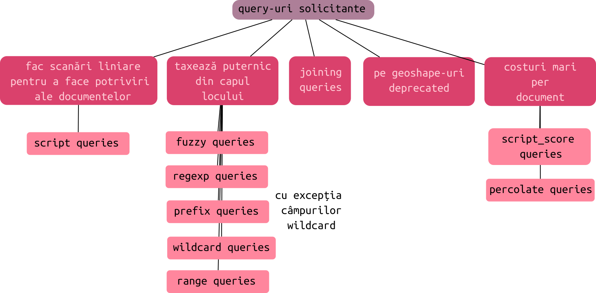

# Căutare în Elasticsearch

Regula principală atunci când se face o căutare este aceea că operațiunea implică indexul inversat, nu documentele. Acest detaliu foarte important explică diferențele pe care le obținem în diferitele **contexte de căutare**. Pentru că am menționat contextele de căutare, acestea pot fi două:

- *query context* (se calculează relevanța)
- *filter context* (se verifică dacă documentul există, nu se calculează relevanța).

Un alt aspect important al căutărilor pe care le poți face pe documentele din Elasticsearch este acela că rezultatele vor fi aduse înapoi în ordinea relevanței lor. Relevanța este un număr calculat de Elasticsearch. Într-un context de filtrare, nu este calculată relevanța documentelor.

Căutarea pe termeni (*term query*) se face direct pe indexul inversat, iar o căutare *match query* mai întâi va face o analiză a textului și abia după aceea va căuta în indexul inversat. Căutarea va aduce rezultate în al doilea caz pentru că anterior și textul documentelor a trecut prin același proces de analiză (analizorul folosit pentru câmp este același și pentru textul de căutare).

În Elastisearch fiecare câmp care are o valoare text este automat tratat deopotrivă ca un câmp `text`, dar și ca un câmp `keyword`. Elasticsearch oferă automat acest model în cazul în care nu s-a definit un mapping, ci s-a lăsat la lucru mapping-ul dinamic (*dynamic mapping*).

## Analizori și tokenizatori

Căutarea pe texte folosind analizoarele va returna rezultatele care se aseamănă cu ceea ce se caută. În funcție de setarea analizorului, rezultatele pot fi *case-insensitives*, *stemmed*, se pot elimina semnele de punctuație (*stop words*), se pot folosi sinonimele, etc. Faptul că se face o căutare cu mai multe cuvinte, nu înseamnă că trebuie să fie găsite toate într-un document pentru ca acesta să fie adus. Se vor folosi *text types* pentru respectivele câmpuri. Poți configura diferite analizoare pentru fiecare câmp în parte.

Un analizor este un pachet compus din următoarele blocuri constructive de nivel elementar:

- filtre la nivel de caractere
- tokenizatoare și
- filtre pe tokenuri.

Un analizor are un singur tokenizator. Analizorii din oficiu includ deja aceste blocuri constructive pentru a răspunde adecvat diferitelor limbi și tipuri de text.

În unele cazuri, căutarea trebuie să fie precisă. Doar o anumită combinație de cuvinte trebuie să fie găsită pentru a returna un document și exact combinația de majuscule. Se va folosi un *keyword type* atunci când definești un index. Folosirea acestuia va dezactiva analizoarele pentru acel câmp.

### Analizoare

#### Interogare folosind `match`.

Acest tip de analizor este folosit în cazul în care dorești să aduci toate documentele care se potrivesc cu stringul pe care-l pasezi pentru un anumit câmp.

```bash
curl -H 'Content-Type: application/json' -XGET 127.0.0.1:9200/movies/_search?pretty -d '
{
  "query": {
    "match": {
      "title": "Star Trek"
    }
  }
}'
```

Răspunsul include rezultate ce conțin cuvântul `Star` în câmpul `title`. Ceea ce este important de remarcat este scorul. Pentru Star Trek, acesta este  `2.5194323`, iar pentru Star Wars este `0.66992384`. Deci, primele rezultate în cazul folosirii analizoarelor sunt cele mai importante, chiar dacă setul de date returnat conține și documentele în care sunt doar câteva dintre cuvintele căutate.

```json
{
  "took" : 4,
  "timed_out" : false,
  "_shards" : {
    "total" : 1,
    "successful" : 1,
    "skipped" : 0,
    "failed" : 0
  },
  "hits" : {
    "total" : {
      "value" : 2,
      "relation" : "eq"
    },
    "max_score" : 2.5194323,
    "hits" : [
      {
        "_index" : "movies",
        "_type" : "_doc",
        "_id" : "135569",
        "_score" : 2.5194323,
        "_source" : {
          "id" : "135569",
          "title" : "Star Trek Beyond",
          "year" : 2016,
          "genre" : [
            "Action",
            "Adventure",
            "Sci-Fi"
          ]
        }
      },
      {
        "_index" : "movies",
        "_type" : "_doc",
        "_id" : "122886",
        "_score" : 0.66992384,
        "_source" : {
          "id" : "122886",
          "title" : "Star Wars: Episode VII - The Force Awakens",
          "year" : 2015,
          "genre" : [
            "Action",
            "Adventure",
            "Fantasy",
            "Sci-Fi",
            "IMAX"
          ]
        }
      }
    ]
  }
}
```

#### Interogare folosind `match_phrase`

Analizorul oferă toate documentele care conțin fragmentul de text pasat pentru un anumit câmp. Rezultatele vor fi alese în ordinea cuvintelor pasate. Acest lucru este posibil pentru că în indexul inversat, nu numai că se face o potrivire a termenilor dintr-un text, dar este memorată și poziția acestor termeni în text.

```bash
curl -H 'Content-Type: application/json' -XGET 127.0.0.1:9200/movies/_search?pretty -d '
{
  "query": {
    "match_phrase": {
      "title": "star wars"
    }
  }
}'
```

În cazul în care poziția termenului nu este importantă, folosind `slop`, vei menționa cu cât poate fi depărtat un termen față de anteriorul într-un text, indiferent de direcție.

```bash
curl -H 'Content-Type: application/json' -XGET 127.0.0.1:9200/movies/_search?pretty -d '
{
  "query": {
    "match_phrase": {
      "title": {
        "query": {
          "star beyond", "slop": 1
        }
      }
     }
    }
  }
}'
```

În exemplul anterior, va fi adus un document care are titlul `star trek beyond` pentru că are deplasarea de un termen față de primul menționat în query. Va mai aduce și documentele care au titlul `beyond star` pentru că `slop` permite deplasarea și în stânga. Putem traduce o astfel de căutare, ca o căutare în proximitate (*proximity query*).

Dacă `slop` ar avea o valoare foarte mare, să spunem de 50, căutarea va returna toate rezultatele care au cei doi termeni la o distanță de alți 50 între ei.

## Căutare prin link

Termenii de căutare pot fi introduși într-un query string în link. O astfel de căutare se numește `uri search` (vezi și documentația Elasticsearch).

```text
http://127.0.0.1:9200/movies/_search?q=title:star
http://127.0.0.1:9200/movies/_search?q=+year:>2010+title:trek
```

Aceste interogări se pot face în browser și este returnat un obiect JSON. Problema este legată de necesitatea de a coda URL-ul pentru a trimite datele de interogare pe net.

Nu se va folosi această posibilitate în mediile de producție. Din punct de vedere al securității este un punct foarte sensibil prin care s-ar putea iniția activități ce pot suprasolicita serverul.

## Căutare cu filtre

Interogările există în blocuri `"query"`, iar filtrele în blocuri `"filter"`.
Poți introduce filtre în query-uri, dar dacă este necesar, poți introduce și query-uri în filtre.

Atunci când dorești să combini mai multe filtre, se va folosi un block `"bool"` într-unul `"query"`.

### Căutare booleană

Căutarea booleană permite combinarea mai multor filtre folosind proprietatea `bool`. În exemplul prezentat, rezultatele vor fi aduse, dacă în document sunt găsite cele care au textul `trek` în titlu și care au fost lansate de la începutul anului 2010.

```bash
curl -H "Content-Type: application/json" -XGET 127.0.0.1:9200/movies/_search?pretty -d '
{
  "query": {
    "bool": {
      "must"  : {"term" : {"title": "trek"}},
      "filter": {"range": {"year" : {"gte": 2010}}}
    }
  }
}'
```

În exemplul, se contruiește un `"query"` care **trebuie** să conțină **termenul** (`"term"`) trek, iar din documentele care respectă această cerință strictă se va face o **filtrare**, care să aducă doar un subset (`"range"`) de documente care au la câmpul `"year"` o valoarea mai mare sau egală (`"gte"` - greatter than equal) cu 2010.

### Filtre

Căutarea la nivel de termen este folosită ca atare atunci când se dorește identificarea documentelor după un anumit termen, fie acesta o valoare numerică, boolean, keyword și cam toate valorile care nu au trecut prin faza de analiză pentru că acestea sunt modificate înainte de a ajunge în indexul inversat.

#### `term`

Este folosit pentru a face filtrări foarte exacte folosind un singur termen. Căutarea se face direct în indexul inversat. Asta înseamnă că termenul trebuie să fie exact ca unul care a trecut deja printr-un analizor.

```yaml
GET /movies/_search
{
  "query":{
    "term": {
      "year": 2014
    }
  }
}
```

Atunci când ai un câmp a cărui mapping s-a făcut pentru o valoare boolean, nu mai trebuie configurat câmpul precum în următorul exemplu:

```yaml
GET /movies/_search
{
  "query":{
    "term": {
      "administrator": true
    }
  }
}
```

Varianta canonică care implică un obiect de configurare este:

```yaml
GET /movies/_search
{
  "query":{
    "term": {
      "administrator": {
        "value": true
      }
    }
  }
}
```

Ceea ce permite varianta canonică este adăugarea de opțiuni suplimentare.
De regulă, vei folosi acest filtru pentru a căuta date calendaristice, numere, booleanuri, termeni din câmpuri cu valoare text, câmpuri de tip keyword pentru că aceste nu sunt analizate. Reține faptul că *term  queries* nu sunt nici ele analizate și asta oferă rezultate predictibile pentru că se face o căutare exactă.

#### `terms`

Adu-ți mereu aminte că În Elasticsearch fiecare câmp care are o valoare `text` este automat tratat deopotrivă ca un câmp de `text`, dar și ca un câmp `keyword` dacă este permisă maparea dinamică.

Filtrul este folosit pentru a face filtrări după o listă de termeni menționați într-un `Array`. Documentul va fi pus în setul celor găsite dacă conține în câmpul specificat una din valorile din array.

```yaml
GET /movies/_search
{
  "query": {
    "terms": {
      "genre": ["Sci-Fi", "Adventure"]
    }
  }
}
```

#### `range`

Acest filtru este folosit pentru a căuta documente într-un interval menționat de câțiva specificatori (`gt`, `gte`, `lt`, `lte`).

```json
"range": {"year": ["gte", 2010]}
```

Poți specifica drept limite date calendaristice. Folosind proprietatea `format`, poți indica în ce format este introdusă data calendaristică în câmp. Să presupunem că datele din documente sunt exprimate după următorul format: `2019/03/23`. Dacă dorim să fie făcută căutarea folosind un alt format, de exemplu `23-03-2019`, atunci va trebui să-i spunem lui Elasticsearch formatul în care să transforme datele calendaristice originale înainte de a face căutarea.

```yaml
GET /movies/_search
{
  "query":{
    "range":{
        "created":{
            "gte":"23-03-2019",
            "lte":"23-04-2019",
            "format":"dd-MM-yyyy"
          }
      }
    }
}
```

Lucrul cu datele este permis și în afara operațiunilor cu intervale. Elasticsearch folosește simbolul `||` după o dată calendaristică pentru a face calcule în baza datei specificată anterior numită *achor date*. De exemplu, poți adăuga o zi sau scădea o săptămână sau un an: `"gte":"23-03-2019||-1w"`. Dacă vreau să scad o săptămână și o zi peste: `"gte":"23-03-2019||-1w-1d"`.
Datele calendaristice pot fi rotunjite dacă este necesar. Rotunjirea se face precizând un slash după dată și care parte să fie rotunjită: `"gte":"23-03-2019||-1w-1d/M"` - rotunjire cu luna. Rotunjirea datei poate fi făcută și la început: `"gte":"23-03-2019||/M-1w-1d"`.

Dacă se dorește interogarea după momentul curent, nu mai este nevoie de `||` și se va preciza `now`: `"gte":"now-1w-1d/M"`.

#### `exists`

Caută doar documentele în care un câmp specificat există.

```json
{"exists": {"field": "tags"}}
```

#### `missing`

Caută documentele din care lipsește câmpul specificat în query.

```json
{"missing": {"field": "tags"}}
```

## Tipuri de query-uri

### Căutări Boolean


#### `bool`

Acest filtru este cel care permite combinarea filtrelor folosindu-se logica booleană. Poate avea următorii specificatori:

- `must`,
- `must_not`,
- `should`.

### Căutări pe texte


#### `match` query

Acest tip de interogare selectează documentele care se potrivesc cu o cheie de căutare care poate fi text, număr, dată sau o valoare boolean. Textul care este primit este analizat înainte de a se face operațiunea de căutare. Această interogare este folosită pentru căutarea full-text, fiind inclusă și opțiunea pentru regăsire în baza logicii fuzzy. Un exemplu oferit de sursa documentației este următorul.

```bash
GET /_search
{
  "query": {
    "match": {
      "message": {
        "query": "this is a test"
      }
    }
  }
}
```

Căutările `match` sunt foarte potrivite pentru căutarea unui fragment (cheie de căutare), care vine de la un input text. Fragmentul după care se face căutarea va fi trecut prin același analizor care a fost specificat pentru respectivul câmp. Pentru a vedea care este acela, trebuie verificat mapping-ul. Adu-ți aminte că la căutările la nivel de termen, aceștia nu sunt [analizați](https://www.elastic.co/guide/en/elasticsearch/reference/current/analysis.html).

Cautarea se face în rezultate care sunt generate de analizori, așa cum ar fi cazul unei căutări în text (*full text search*).

```json
{"match": {"title": "star"}}
```

Operatorul din oficiu pentru termenii din cheia de căutare este OR. Vor fi aduse toate documentele în care pot exista combinații ale termenilor din sintagma de căutare. Chiar dacă este numai unu, se constituie set cu toate documentele care îl conțin. Poți modifica comportamentul de căutare, modificând acest operator la AND. Acest lucru înseamnă că toți termenii din cheia de căutare, trebuie să existe în câmpul pentru care se face căutarea.

```bash
GET /recipe/_search
{
  "query":{
    "match":{
      "title":{
        "query": "Recipies with pasta and spaghetti",
        "operator": "and"
      }
    }
  }
}
```

O variantă simplificată ar fi combinația dintre query și câmp.

```bash
GET /_search
{
  "query": {
    "match": {
      "message": "this is a test"
    }
  }
}
```

După cum se observă în exemplu, câmpul după care faci căutarea se poate parametra mai departe. Să investigăm cum se parametrează câmpul.

**Parametrul `query`**
Acesta este obligatoriu. O căutare *match* va analiza textul înainte de a face o căutare. Acest lucru înseamnă că o căutare *match* va face o căutare în câmpuri text după tokenii rezultați din analiză, nu neapărat după termenii exacți.

**Parametrul `analyzer`**
Este un string cate poate fi introdus opțional, precizând [ce analizor](https://www.elastic.co/guide/en/elasticsearch/reference/current/specify-analyzer.html) va fi utilizat pentru a converti textul introdus drept valoare lui `query` în tokeni. În cazul în care nu este precizat un analizor în mod explicit, va fi folosit cel care este introdus în mapping pentru acel câmp - [index-time-analyzer](https://www.elastic.co/guide/en/elasticsearch/reference/current/specify-analyzer.html#specify-index-time-analyzer). Un exemplu oferit de textul documentației ar fi.

```bash
PUT my-index-000001
{
  "mappings": {
    "properties": {
      "title": {
        "type": "text",
        "analyzer": "whitespace"
      }
    }
  }
}
```

În cazul în care nu există nici în mapping vreo precizare privind analizorul, este folosit analizorul din oficiu pe care indexul îl folosește. La următorul link poți vedea cum este determinat analizorul din oficiu: https://www.elastic.co/guide/en/elasticsearch/reference/current/specify-analyzer.html#specify-search-analyzer.

**Parametrul `auto_generate_synonyms_phrase_query`**
Este un boolean care dacă este `true` vor fi create query-uri *match phrase* automat pentru generarea de sinonime multi-termen. Valoarea din oficiu este `true`. Această opțiune implică un filtru pentru token-uri numit `synonym_graph`. De exemplu, pentru sinonimele `ny, new york` se va produce o potrivire `(ny OR ("new york"))`.

**Parametrul `fuzziness`**
Este un parametru opțional care atunci când este folosit poți aduce documente care se potrivesc **vag** fragmentului căutat atunci când se face o căutare pe câmpuri a căror valoare este text sau keyword. Acest criteriu de căutare se bazează pe algoritmul *Levenshtein distance* (https://en.wikipedia.org/wiki/Levenshtein_distance) și în linii mari precizează care este numărul de caractere care sunt diferite de ceea ce ar trebui să fie pentru a face regăsirea. Adică, care ar fi distanța/diferența dintre două cuvinte să fie același lucru - [fuzziness](https://www.elastic.co/guide/en/elasticsearch/reference/current/common-options.html#fuzziness).

**Parametrul `max_expansions`**
Este un număr întreg care reprezintă numărul maxim de termeni care vor fi luați în considerare. Numărul din oficiu este `50`.

**Parametrul `prefix_length`**
Este un număr întreg care reprezintă de caratere de la început care vor fi neatinse de procedura fuzzy. Valoarea din oficiu este `0`.

**Parametrul `fuzzy_transpositions`**
Este un boolean opțional, care setat la `true` editările care se vor face pentru căutările fuzzy include transpoziția a două caractere alăturare: (ab → ba). Valoarea din oficiu este `true`.

**Parametrul `fuzzy_rewrite`**
Acesta este un șir de caractere opțional. Acesta indică metoda folosită pentru a rescrie query-ul. Dacă parametrul `fuzziness` nu este `0`, query-ul `match` folosește din oficiu o metodă `fuzzy_rewrite` numită `top_terms_blended_freqs_${max_expansions}`.

**Parametrul `lenient`**
Acesta este o valoare boolean, care în cazul în care este `true`, erorile de formatare cum ar fi introducerea unei valori text pentru un câmp numeric. vor fi ignorate. Valoarea din oficiu este `false`.

**Operatorul `operator`**
Este o valoare boolean care este folosită pentru a interpreta textul din query. Valorile pentru care se folosește sunt:
 - `OR` (din oficiu). De exemplu, pentru o valoare a query-ului `city of Bucharest`, vei avea o interpretare `city OR Bucharest`;
 - `AND` va remodela interpretarea precum în `city AND Bucharest`.

 **Operatorul `minimum_should_match`**
Este un String opțional care reprezintă numărul maxim de condiții pe care un document trebuie să le întrunească pentru ca un document să fie luat în calcul.

**Operatorul `zero_terms_query`**
Este un string opțional care indică dacă documentele nu vor fi returnate în cazul în care `analyzer` elimină toți tokenii, precum în cazul folosirii filtrului `stop`. Valorile valide sunt:
- `none` (valoarea din oficiu) - nu sunt returnate documente dacă sunt eliminați de `analyzer`;
- `all` - returnează toate documentele similar query-ului `match_all`.

Sursa: https://www.elastic.co/guide/en/elasticsearch/reference/current/query-dsl-match-query.html

#### match_phrase

În această căutare ordinea termenilor din sintagma de căutare are importanță. Cuvintele trebuie să apară chiar în ordinea specificată în cheia de căutare în câmpul documentelor pentru a se putea contabiliza în rezultatul de căutare.

```bash
GET /reteta/_search
{
  "query":{
    "match_phrase":{
      "title": "spaghetti puttanesca"
    }
  }
}
```

Acest tip de căutare, căutarea unei fraze este posibilă pentru că în indexul inversat este ținută minte și poziția termenilor.

În cazul în care un câmp conține ambii termeni, scorul de relevanță crește comparativ cu documentele care au în câmpurile specificate doar câte unul din ei.

Poți introduce și o anumită posibilă distanță între termenii din frază introducând opțiunea `slop`.

```json
{
  "query": {
    "match_phrase": {
      "title": {
        "query": "spaghetti umplute cu carne",
        "slop": 1
      }
    }
  }
}
```

În exemplul de mai sus, la o căutare , va aduce documentele care au un termen între `spaghetti` și `carne`. Acest lucru este realizat prin utilizarea opțiunii `slop`, care face potriviri în stânga și în dreapta primului termen în cazul nostru pentru a găsi posibile documente. Slop permite așa-numitele căutări în proximitate.

Daă pui un slop mare, va regăsi toate documentele care au respectivii termeni, dar scorul cel mai mare îl vor avea documentele care vor avea termenii cel mai apropiați unul de celălalt.

#### match_all

```json
{"match_all": {}}
```

#### multi_match

Fă aceeași căutare pe mai multe câmpuri.

```json
{
  "multi_match": {
    "query": "star",
    "fields": ["title", "synopsis"]
  }
}
```

Sursa: https://www.elastic.co/guide/en/elasticsearch/reference/7.x/query-dsl-multi-match-query.html

### Geo queries


## Căutarea după id

```bash
GET /movies/_search
{
  "query": {
    "ids": {
      "values": [135569, 122886]
    }
  }
}
```

## Sortarea rezultatelor

Pentru a sorta rezultatele atunci când documentele sunt căutate după un anumit câmp, vei avea nevoie de unul care să permită acest lucru. Câmpurile care permit sortarea sunt cele care nu sunt analizate.

Una din soluții ar fi ca să faci o dublură a câmpului care este supus analizorilor și să-l declari ca fiind `raw`, iar tipul acestuia să fie `keyword`. Aceste măsuri de prevedere se fac la momentul în care este constituit mapping-ul. Fii foarte atent la faptul că nu poți schimba mapping-ului unui index existent. Deci, va trebui gândită această eventualitate de la bun început.

```bash
curl -H "Content:Type: application/json" -XPUT '127.0.0.1:9200/movies/' -d '
{
  "mappings": {
    "properties": {
      "titlu": {
        "type": "text",
        "fields": {
          "raw": {
            "type": "keyword"
          }
        }
      }
    }
  }
}'
```

Apoi, când vei face sortarea va fi `{sort: "titlu.raw"}`.

## Potriviri aproximative - fuzzy

Este metoda prin care sunt găsite documente chiar dacă au fost întâmpinate erori de redactare. Mecanismul se numește *distanță de editare levenshtein* prin care se fac substituiri de caractere, inserarea unora sau chiar ștergerea acestora.

```bash
curl -H "Content-Type: application/json" -XGET '127.0.0.1:9200/movies/_search?pretty' -d '
{
  "query": {
    "fuzzy": {
      "title": {"value": "intersteller", "fuzziness": 1}
    }
  }
}'
```

## Căutare cu prefixuri

În caz că dorești să aduci rezultate la filtrarea după un termen care începe cu un anumit fragment, poți folosi `prefix` în query.

```bash
curl -H "Content-Type: application/json" -XGET '127.0.0.1:9200/movies/_search?pretty' -d '
{
  "query": {
    "prefix": {
      "year": "201"
    }
  }
}'
```

Folosind Dev Console (Kibana):

```yaml
GET /movies/_search
{
  "query": {
    "prefix":{
      "title": {
        "value": "sta"
      }
    }
  }
}
```

## Căutare cu *wildcard* și ?

Uneori ai nevoie să substitui o porțiune din termenul căutat. Acest lucru se face cu un wildcard marcat printr-o steluță. Un wildcard înlocuiește orice fragment regăsind chiar și documente care nu mai au niciun caracter după wildcard.

```bash
curl -H "Content-Type: application/json" -XGET '127.0.0.1:9200/movies/_search?pretty' -d '
{
  "query": {
    "wildcard": {
      "title": "Inter*"
    }
  }
}'
```

Wildcardul poate să stea oriunde în fragmentul de text supă care se face căutarea. Pur și simplu va înlocui absolut orice începând cu locul de unde apare până la capăt sau până la un alt fragment de text, dacă acesta este menționat.

Semnul întrebării este un locțiitor pentru un singur caracter.

```yaml
GET /movies/_search
{
  "query": {
    "wildcard": {
      "genre":{
        "value": "Sci?Fi"
      }
    }
  }
}
```

Căutările cu wildcard-urile taxează resursele de server pentru că are de căutat o sumedenie de variante. Nu pune un wildcard sau semnul întrebării la începutul fragmentului de căutare pentru că va afecta foarte rău resursele de calcul.

## Căutarea folosind expresii regulate

Poți face căutări folosind RegExp-ul Lucene. Acest lucru înseamnă că anumite lucruri nu vor funcționa, precum ancorele sau `/d`.

```yaml
GET /movies/_search
{
  "query": {
    "regexp": {
      "genre":{
        "value": "Sci-[a-zA-Z]+i"
      }
    }
  }
}
```

## Caută în timp ce scrii cu n-grams

Să pornim cu un termen pentru care să introducem câteva n-gram-uri. Pentru `start`, am putea avea următoarele n-gram-uri:

- *unigram*: [s,t,a,r]
- *bigram*:  [st, ta, ar]
- *trigram*: [sta, tar]
- *4-gram*:  [star]

Mai există așa-numitele `edge n-grams`, care sunt construite doar pentru caracterele cu care începe un cuvânt. De exemplu, pentru a construi n-gram-ul pentru termenul `star`, voi avea următoarele posibile combinații:

- *unigram*: [s]
- *bigram*:  [st]
- *trigram*: [sta]
- *4-gram*:  [star]

Pentru a folosi acest instrument, mai întâi trebuie să creezi propriul analizor. Să creăm un n-gram de minim un caracter și un maximum de 20. Acest analizor trebuie introdus înainte de mapping pentru că mapping-ul trebuie să facă referință la acesta.

```bash
curl -H "Content-Type: application/json" -XPUT '127.0.0.1:9200/movies?pretty' -d '
{
  "settings": {
    "analysis": {
      "filter": {
        "autocomplete_filter": {
          "type": "edge_ngram",
          "min_gram": 1,
          "max_gram": 20
        }
      },
      "analyzer": {
        "autocomplete": {
          "type": "custom",
          "tokenizer":"standard",
          "filter": ["lowercase","autocomplete_filter"]
        }
      }
    }
  }
}'
```

Urmează mapping-ul.

```bash
curl -H "Content-Type: application/json" -XPUT '127.0.0.1:9200/movies/_mapping?pretty' -d '
{
  "properties": {
    "title": {
      "type": "text",
      "analyzer": "autocomplete"
    }
  }
}'
```

În acest moment poți folosi n-gram-urile pe index.

```bash
curl -H "Content-Type: application/json" -XGET '127.0.0.1:9200/movies/_search?pretty' -d '
{
  "query": {
    "match": {
      "title": {
        "query":"sta",
        "analyzer": "standard"
      }
    }
  }
}'
```

Fii foarte atent ca la interogare să folosești analizorul standard pentru că de vei utiliza pe `autocomplete` vor fi aduse toate rezultatele care se potrivesc n-gram-urile începând cu o simgură literă, prima din cuvântul pasat pentru căutare, apoi prima literă cu a doua ș.a.m.d. Pentru a evita această situație, în căutare se va preciza analizorul standard. Pentru a rafina cu adevărat rezultatele aduse pe măsură ce utilizatorul tastează termenul de căutare, se recomandă folosirea mecanismului de *completion suggestion*.

Înainte de a folosi, poți testa un analizor pentru a vedea ce rezultate obții folosind un index existent.

```bash
GET movies/_analyze
{
  "analyze": "autocomplete",
  "text": "Sta"
}
```

Elasticsearch permite încărcarea dinainte a posibilelor variante de auto-complete folosind ceea ce se numește *completion suggestion*.

## Căutarea din perspectiva taxării resurselor

Anumite interogări vor fi executate generând un timp mai îndelungat datorită modului în care sunt implementate.



## Resurse

- [Script query](https://www.elastic.co/guide/en/elasticsearch/reference/current/query-dsl-script-query.html)
- [Fuzzy query](https://www.elastic.co/guide/en/elasticsearch/reference/current/query-dsl-fuzzy-query.html)
