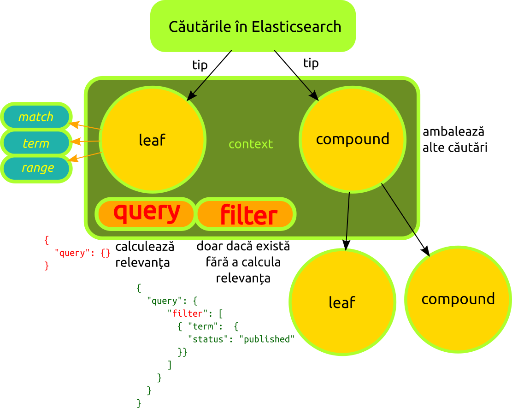

# Query DSL (Domain Specific Language)

Limbajul de interogare folosit de Elasticsearch se bazează pe JSON. Endpointul folosit pentru interogări, se numește `_search`. Pentru a elabora interogarea, se va pasa endpoint-ului un obiect cu o cheie `query`.

De la bun început, Elasticsearch face sortarea rezultatelor căutărilor în baza unui **relevance score**.
Scorul de relevanță este un număr cu virgulă mobilă, care este prezent în meta-field-ul `_score`. Cu cât este mai mare valoarea lui `_score`, cu atât este documentul mai relevant.

Fiecare interogare poate calcula diferit valoarea lui `_score`, dar valoarea este influențată de contextul în care este făcută căutarea: *query* sau *filter*.

Există două tipuri de interogări:

- *Leaf query clauses*
- *Compound query clauses*

Aceste interogări își modifică comportamentul în funcție de **contextul** în care sunt folosite:

- *query context*
- *filter context*.

## Leaf query clauses

Sunt interogări care caută o anumită valoare într-un anumit câmp. Interogările posibile sunt:

- `match`,
- `term`,
- `range`.

## Compound query clauses

Aceste interogări ambalează alte căutări *leaf* sau *compound* și sunt folosite pentru a combina mai multe interogări într-un mod logic.

```json
{
  "bool": {
    "must":     { "match": { "tweet": "elasticsearch" }},
    "must_not": { "match": { "name": "mary" }},
    "should":   { "match": { "tweet": "full text" }}
  }
}
```

Trebuie precizat faptul că un enunț *compound* poate combina oricare alte enunțuri de interogare chiar și alte enunțuri *compound*. Acest lucru înseamnă că enunțurile *compound* for crea structuri imbricate de mare adâncime.

## Contextul de căutare

Chiar dacă atunci când ne referim la DSL-ul Elastisearch-ului ca la un singur lucru, de fapt trebuie să-l privim ca DSL-ul query-urilor și DSL-ul filtrărilor.

Un filtru acționează ca o întrebare da sau nu pentru fiecare document și folosește câmpuri care au valori precise. Un query este similar unui filtru, dar pune și intrebarea următoare: *cât de bine se potrivește acest document*? Un query calculează cât de relevant este un document.

### Query context

În acest context, interogarea răspunde la întrebarea „Cât de bine se potrivește acest document la cerințele interogării?”. Acest context influiențează calculul relevanței în meta-câmpul `_score`. Query-urile sunt introduse într-un bloc `"query": {}`. Un bloc query poate conține blocuri `bool` și `filter`.

Un exemplu simplu ar fi căutarea tuturor documentelor care au în titlu termenul `undeva` (`must` care este echivalentul unui `AND`).

```json
{
  "query": {
    "bool": {
      "must": {"term": {"title": "undeva"}},
      "filter": {"range": {"an": {"gte": 2012}}}
    }
  }
}
```

#### match_all

Este o interogare care caută în toate câmpurile documentelor. Dacă nu menționezi niciun criteriu de căutare, va aduce doate documentele indexului.

```json
{ "match_all": {}}
```

Această interogare este utilizată frecvent cu un filtru. Toate documentele sunt considerate a fi egale ca relevanță așa că vor primi un `_score` de 1.

#### match

Această interogare ar trebui folosită pentru căutarea full-text sau o anumită valoare în câmpul unui document.

```json
{"match": {"nume_intreg": "Ion Vasilache"}}
```

#### match_phrase

Atunci când ai nevoie să cauți toți termenii în ordinea în care au fost menționați, vei folosi `match-phrase`. Acest lucru este posibil Pentru că în indexul inversat este memorată și ordinea în care termenii apar.

```json
{
  "query": {
    "match_phrase": {
      "titlul": "Undeva în Valea Jiului"
    }
  }
}
```

#### multi-match

Acest query permite rularea aceluiași query pe mai multe câmpuri.

```json
{
  "multi_match": {
    "query": "un fragment de căutat",
    "fields": ["descriere", "miscelanea"]
  }
}
```

### Filter context

În acest context, interogarea răspunde dacă se potrivește strict vreun rezultat la cerințele interogării. Răspunsul este da sau nu. Nu este calculat scorul de relevanță. Acest context este folosit pentru a filtra date structurate. De exemplu: este câmpul „timestamp” între 2010 și 2011? sau este câmpul „status” setat la valoarea „published”? Filtrările sunt introduse într-un bloc `"filter": {}`.

Filtrările folosite frecvent sunt cache-uite de Elasticsearch. Reține faptul că filtrările vor fi cache-uite.

O filtrare este pasată unui parametru `filter`.

#### term

Filtrul `term` este folosit pentru a filtra după valori exacte, fie acestea date calendaristice, numele, boolean-uri sau fragmente string care corespund exact unor valori ale unor câmpuri `not_analyzed`.

```json
{"term": {"varsta": 23}}
```

#### terms

Varianta la plural permite menționarea a mai multor termeni.

```json
{"terms": {"etichete": ["ceva", "altceva", "undeva"]}}
```

Acceptă următorii operatori: `gt`, `gte`, `lt`, `lte`.

#### range

Acest filtru îți permite căutarea de numere sau date calendaristice într-una din plajele de valori.

```json
{
  "range": {
    "age": {
      "gte": 20,
      "lt":  30
    }
  }
}
```

#### exists și missing

Sunt folosiți pentru a căuta documente în care câmpul specificat are una sau mai multe valori (*existing*) sau nu are valoarea (*missing*).

```json
{
  "exists": {
    "field": "nume"
  }
}
```

Aceste filtre sunt folosite în mod curent pentru a aplica o condiție doar dacă un câmp există sau nu.

#### bool

Este folosit pentru a combina mai multe enunțuri de filtrare folosind logica boolean. Acest filtru acceptă trei parametri:

- `must`: enunțurile specificate drept valoare trebuie să găsească o potrivire. Este echivalentul lui `AND`;
- `must_not`: enunțurile nu trebuie să găsească nicio potrivire. Echivalentul lui `NOT`;
- `should`: cel puțin unul dintre enunțuri trebuie să potrivească un rezultat. Echivalentul lui `OR`.

Toți acești parametri acceptă, fie un singur enunț, fie un array de enunțuri de filtrare:

```json
{
  "bool": {
    "must": {"term": {"nume": "Eustasiu"}},
    "must_not": {"term": {"tag": "începători"}},
    "should": [
      {"term": {"administrator": false}},
      {"term": {"limbaj": "python"}}
    ]
  }
}
```

## Exemplu de contexte `query` și `filter`

Parametrul `query` indică contextul de interogare.
Termenul `bool` urmat de cele două `must`-uri, este folosit într-un context query, însemnând că este folosit pentru a căuta cât de bine se potrivesc rezultatele.
Termenul `filter` indică un context de filtrare. Condițiile sunt menționate prin `term` și `range`. Filtrarea va elimina toate documentele care nu întrunesc cerințele, dar nu va modifica scorul documentelor care se potrivesc.

```json
{
  "query": {
    "bool": {
      "must": [
        { "match": { "title":   "Search"        }},
        { "match": { "content": "Elasticsearch" }}
      ],
      "filter": [
        { "term":  { "status": "published" }},
        { "range": { "publish_date": { "gte": "2015-01-01" }}}
      ]
    }
  }
}
```

Condițiile care trebuie îndeplinite:

- Câmpul `title` conține termenul `search`;
- Câmpul `content` conține termenul `elasticsearch`;
- Câmpul `status` conține fix termenul `published`;
- Câmpul `publish_date` conține o dată începând cu 1 Ianuarie 2015.



## Resurse

- [Deep Dive into Querying Elasticsearch. Filter vs Query. Full-text search](https://towardsdatascience.com/deep-dive-into-querying-elasticsearch-filter-vs-query-full-text-search-b861b06bd4c0)
- [Text Classification made easy with Elasticsearch](https://www.elastic.co/blog/text-classification-made-easy-with-elasticsearch)
