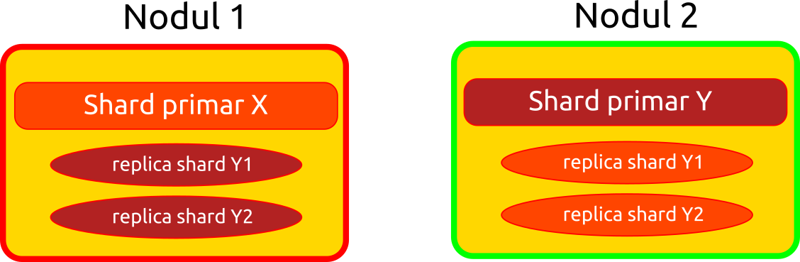

# Replicarea în Elasticsearch

## Sharding

Modul prin care se face spargerea indicilor în mai multe fragmente mici se numește sharding. Această operațiune se petrece la nivel de index. În cazul unui index cu peste un miliard de documente, această măsură este necesară. Shardingul permite scalarea pe orizontală a volumului de date. Aceste fragmente (*shards*) pot fi distribuite pe mai multe noduri. De exemplu, în cazul în care ai două noduri, fiecare cu o dimensiune mai mică decât a unui indice, acesta va putea fi spart în două shard-uri. Fiecare va sta pe câte un nod separat.
Fiecare shard este, de fapt un indice Apache Lucene. Un shard poate stoca până la două miliarde de documente.

## Replicare

Replicarea este configurată la nivel de index.
Replicarea constă în copierea shard-urilor pe care un index le conține. Aceste shard-uri replicate sunt numite *replica shards*. Shardurile sunt găzduite în noduri. Mai multe noduri constituie un cluster.



Pentru a investiga starea unui cluster, ai la îndemână endpoint-ul `_cluster`. Un posibil exemplu este investigarea stării unui cluster.

```yaml
GET _cluster/health
```

Un răspuns poate fi similar cu următorul obiect.

```json
{
  "cluster_name" : "aplicatii",
  "status" : "yellow",
  "timed_out" : false,
  "number_of_nodes" : 1,
  "number_of_data_nodes" : 1,
  "active_primary_shards" : 63,
  "active_shards" : 63,
  "relocating_shards" : 0,
  "initializing_shards" : 0,
  "unassigned_shards" : 40,
  "delayed_unassigned_shards" : 0,
  "number_of_pending_tasks" : 0,
  "number_of_in_flight_fetch" : 0,
  "task_max_waiting_in_queue_millis" : 0,
  "active_shards_percent_as_number" : 61.165048543689316
}
```

Acestea sunt copii ale unui shard și pot fi interogate la fel cum sunt interogate *primary shard*-urile. Numărul de replici poate fi configurat la momentul creării indexului. Valoarea din oficiu este unu. De exemplu, în momentul în care este creat un index fără parametrizare în ceea ce privește shard-urile, vor fi create din oficiu un primary shard și un replica shard.

Penttru a investiga starea indicilor ș astfel și a shard-urilor, se poate folosi endpoint-ul `_cat`, precum în următorul exemplu.

```yaml
GET _cat/indices?v
```

Această comandă va oferi un răspuns similar cu următorul.

```text
health status index                         uuid  pri rep docs.count docs.deleted store.size pri.store.size
yellow open   europeana   HpCYxq4kSmOgpD86Pl-Rmw   5   1          2            0    179.6kb        179.6kb
yellow open   movie       nzc6H8LfRmec8C4tVDhlOg   1   1          0            0       283b           283b
yellow open   movies      HUJ4uuuTSa2THsgFG7QYjg   1   1          5            0      4.8kb          4.8kb
yellow open   twitter     5jRio_LyT1-SNNxhL8VZMw   3   2          0            0       795b           795b
yellow open   miscelanee  zjsWxPwESQ68w17IemUw8w   1   1          3            1     10.7kb         10.7kb
yellow open   users       QLgoUH8DTW--CGuYOUyOPQ   1   1          3            0     16.6kb         16.6kb
yellow open   monografii  t8B0mWV0QLq8DIW73ZlmzQ   5   1          1            0      4.7kb          4.7kb
yellow open   shakespeare g-fc2WozTjGZqxRopBk4NA   1   1     111396            0     19.5mb         19.5mb
```

Se observă alocarea de sharduri și replici în coloanele `pri` și `rep`.
Pentru a investiga starea shard-urilor, vom folosi același endpoint, dar pentru shard-uri.

```yaml
GET /_cat/shards?v
```

Cu resultate similare cu următorul răspuns.

```text
shakespeare                     0     p      STARTED    111396  19.5mb 127.0.0.1 nicolaie-G750JX
shakespeare                     0     r      UNASSIGNED
```

Pentru a preveni pierderea de date, *replica shard*-urile nu sunt ținute pe același nod cu *primary shard*-ul. Dar pentru sistemele de producție este nevoie de cel puțin două noduri.

Un shard replicat este numit *primary shard*.
Un *primary shard* și ale sale *replica shards* sunt numite *replication group*. Creșterea numărului de replica shards ajută foarte mult în scenariile de producție, în care se accesează foarte mult o singură replica shard, dacă doar una există. Acest lucru se dovedește util pentru simplu fapt că un replica shard este un index în sine care poate fi interogat. Elasticsearch face o rutare inteligentă a query-urilor către shardurile cele mai viabile pentru a răspunde repede și mai rulează paralelizat căutarea în cazul în care există mai multe shard-uri de replicare în același nod.

În cazul în care avem două shard-uri pe același nod, replicile nu vor fi asignate pentru că avem un singur nod care rulează. Pentru atribuire, ar fi nevoie de un nod suplimentar pe care să le trimită. Fii avertizat de faptul că un nod suplimentar trebuie pus pe o altă mașină. Abia în momentul în care ai alt nod, abia atunci se vor repartiza și replicile.

Pe sistemele de producție este nevoie de cel puțin două noduri pentru a evita pierderile de date. La momentul creării indexurilor, poți configura câte shard-uri și câte replici dorești să ai.

```yaml
PUT /test
{
  "settings": {
    "number_of_shards": 2,
    "number_of_replicas": 2
  }
}
```

Interogând cu `GET _cat/indices?v` vom avea un rezultat asemănător cu următorul:

```text
health status index                   uuid  pri rep docs.count docs.deleted store.size pri.store.size
yellow open   test  UW5tBoCHT0-kb1HCKtJOOA   2   2          0            0       230b           230b

```

*Replica shard* -urile sunt folosite și pentru a elimina bottleneck-urile atunci când primary nu mai face față. Nu uita că un *replica shard* este o copie funcțională a unui shard, ceea ce înseamnă că pot fi interogate în același timp.

Dacă vei crea un index nou, dar disponibil este un singur nod, replica shard-ul care a fost creat odată cu primary-ul, nu are unde să fie alocat, ceea ce va seta *health*-ul indexului la *yellow*. Poți investiga starea shard-urilor cu `GET /_cat/shards?v`. În cazul nealocării replicii unui nod suplimentar, vei avea un rezultat de următorul tip:

```text
resursedus                      0     p      STARTED        29  75.2kb 127.0.0.1 nume_comp
resursedus                      0     r      UNASSIGNED
```

Observă faptul că replica are starea `UNASSIGNED`.

În cazul în care numărul de noduri crește, replicile vor fi alocate automat.

Atenție, creșterea numărului de shard-uri vine la pachet cu necesitatea creării unui nou index în care punem documentele și apoi facem reindexarea lor.

## Rutare

Elasticsearch accesează documentele care se află în shard-uri folosind un mecanism de rutare. Această rutare asigură și o distribuire echilibrată a documentelor între shard-uri. Strategia de rutare poate fi modificată dacă acest lucru este dorit.

## Snapshots

Pentru a realiza mecanisme de backup, Elasticsearch oferă posibilitatea de a face snapshots. Acestea se pot aplica la nivel de index sau chiar la nivel de cluster.
Mai poate fi folosit și pentru creșterea throughput-ului.
